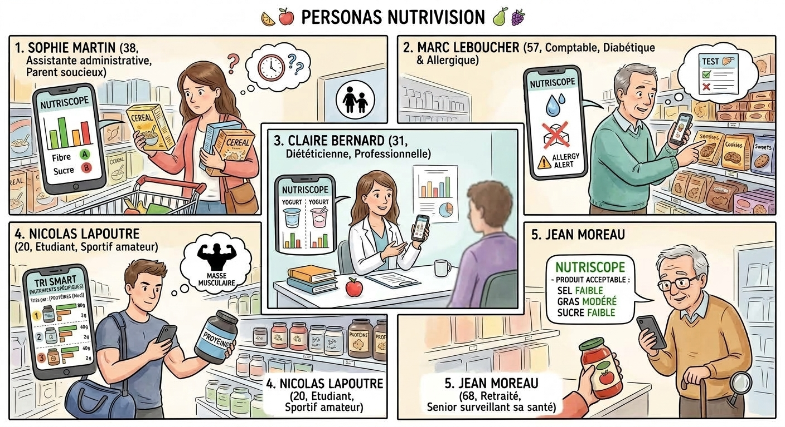

# 1. Parties prenantes & Rôles
- **Direction NutriScope (formateurs)** : commanditaire, validation des jalons.  
- **Équipe IA (nous)** : réalisation du projet.  
- **Formateurs** : rôle de direction, arbitrage.  
- **Utilisateurs finaux** : consommateurs en magasin.

**Identification pouvoir / intérêt**

| Partie prenante              | Pouvoir | Intérêt |
|------------------------------|---------|---------|
| Direction  / Commanditaires  | Fort    | Fort    |
| Utilisateurs                 | Faible  | Fort    |
| Marketing                    | Moyen   | Fort    |
| Equipe Data                  | Faible  | Fort    |
| Equipe Projet                | Moyen   | Fort    |
| Professionnels de santé      | Faible  | Moyen   |
| Open Food Facts              | Faible  | Faible  |
| DPO / Délégué Prot. Data RGPD| Fort    | Fort    |
| Financeurs                   | Fort    | Faible  |

**Postulats**
- On considère ici que le **Marketing** a un pouvoir suffisamment important sur le projet. Dans les premiers mois de l'application, la priorité absolue est d'exister sur les stores et de recruter des utilisateurs. Le marketing prend le lead pour valider le positionnement, concevoir des campagnes d'acquisition agressives, travailler le référencement sur les stores et imaginer la diffusion et l'image.
- **L'équipe Data** au contraire n'a que peu d'impact. Aux prémices de l'application, la base d'utilisateurs est trop petite pour que l'équipe data puisse mener des analyses de comportement significatives ou optimiser des algorithmes de recommandation.
- Il serait pertinent de se rapprocher de **Professionnels de santé** afin de non seulement faire la promotion de l'application auprès d'eux, mais aussi pour avoir leur avis métier.

---

# 2. Personnae identifiés

# 👤 1. Sophie Martin
> **Parent soucieux de l'alimentation familiale**

* **Âge :** 38 ans
* **Profession :** Assistante administrative

**Objectifs :**
- Faire des choix alimentaires plus sains pour sa famille.
- Gagner du temps pendant les courses.
- Comparer rapidement plusieurs produits.

**Freins :**
- Manque de temps.
- Difficulté à comprendre les étiquettes.
- Trop d'informations contradictoires.

> **Situation d'usage :**
> Sophie utilise NutriScope dans les rayons d'un supermarché afin
de comparer plusieurs céréales pour le petit-déjeuner de ses enfants.

# 👤 2. Marc Leboucher
> **Personne diabétique et allergiques**

* **Âge :** 57 ans
* **Profession :** Comptable

**Objectifs :**
- Contrôler sa consommation de sucre.
- Trouver des produits alternatifs respectant ses allergies
- Identifier rapidement les produits adaptés.
- Réduire les risques liés à son alimentation.

**Freins :**
- Lecture complexe des tableaux nutritionnels.
- Difficulté à comparer les produits.

> **Situation d'usage :**
> Marc consulte NutriScope afin de comparer l'impact nutritionnel des produits sucrés ou trouver des alternatives à des produits sur le marché.

# 👤 3. Claire Bernard
> **Diététicienne**

* **Âge :** 31 ans
* **Profession :** Diététicienne nutritionniste

**Objectifs :**
- Disposer d'informations fiables.
- Illustrer ses conseils auprès des patients.
- Comparer plusieurs aliments pour un bilan.

**Freins :**
- Informations dispersées entre plusieurs sources.

> **Situation d'usage :**
> Claire utilise NutriScope afin d'analyser les principales différences entre plusieurs produits aux apports similaires. Elle peut l'utiliser comme argument lors d'une consultation ou pour un bilan nutritionnel.

# 👤 4. Nicolas Lapoutre
> **Sportif amateur**

* **Âge :** 20 ans
* **Profession :** Etudiant

**Objectifs :**
- Chercher à prendre de la masse musculaire.
- Contrôler ses apports nutritionnels en termes d'énergie et de protéines.
- Limiter les aliments ultra-transformés.

**Freins :**
- Marketing nutritionnel parfois trompeur.
- Comparaison difficile entre plusieurs marques.

> **Situation d'usage :**
> Nicolas analyse en magasin les produits protéinés et les boissons énergétiques. Il trie ses recherches selon l'apport en protéines et en énergie.

# 👤 5. Jean Moreau
> **Senior surveillant sa santé**

* **Âge :** 68 ans
* **Profession :** Retraité

**Objectifs :**
- Limiter le sel, le sucre et les graisses.
- Préserver sa santé cardiovasculaire.
- Comprendre facilement les informations nutritionnelles.

**Freins :**
- Applications parfois complexes.
- Terminologie nutritionnelle difficile à interpréter.

> **Situation d'usage :**
> Jean récent dans l'utilisation numérique, consulte ponctuellement NutriScope avant d'acheter un produit qu'il ne connait pas. Il voit facilement si un aliment est faible en sel, en graisse et en sucres.

**CONSOMMATEURS GRAND PUBLIC**

- Sophie Martin
  *Parent soucieux de l'alimentation familiale*

- Jean Moreau
  *Senior attentif à sa santé*

- Nicolas Lapoutre
  *Sportif amateur*

**PERSONNES AVEC BESOINS NUTRITIONNELS SPÉCIFIQUES**

- Marc Leboucher
  *Patient diabétique*

- *Personne souffrant d'hypertension*

- *Personne suivant un régime pauvre en sel*

- *Personne en situation de surpoids*

- *Personne allergique ou intolérante à certains aliments*

- *Patient suivi pour une maladie cardiovasculaire*

**PROFESSIONNELS DE SANTÉ**

- Claire Bernard
  *Diététicienne nutritionniste*

- *Médecin*

- *Coach nutrition*

**PERSONAS LES PLUS PERTINENTS POUR LE PROJET**

1. Sophie Martin
   *Parent soucieux de l'alimentation familiale*

2. Marc Leboucher
   *Patient diabétique et allergique*

3. Nicolas Lapoutre
   *Etudiant sportif amateur*

4. Jean Moreau
   *Senior surveillant sa santé*

**Couverture des besoins :**
- Grand public
- Sport
- Santé / alimentation spécialisée
- Tranches d'âge étalées