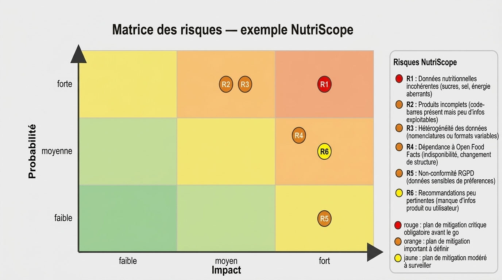

# 3. Analyse des risques

## Objectif

Cette analyse vise à identifier les principaux risques susceptibles d'affecter la qualité des données, la pertinence des résultats et le bon fonctionnement de la solution NutriScope.

Chaque risque est évalué selon :

- sa probabilité d'occurrence ;
- son impact sur le projet ;
- les mesures de mitigation envisageables.

---

## Risque R1 : Données nutritionnelles incohérentes

### Description

Certaines fiches produits peuvent contenir des valeurs nutritionnelles incohérentes ou aberrantes :

- sucres supérieurs à 100 g pour 100 g ;
- sel supérieur à 100 g pour 100 g ;
- énergie négative ;
- valeurs manquantes ou erronées.

### Probabilité

Élevée

### Impact

Élevé

### Niveau de risque

🔴 Critique

### Plan de mitigation

- Mise en place de contrôles qualité automatiques.
- Détection et exclusion des valeurs aberrantes.
- Règles de validation avant exploitation des données.
- Contrôles réguliers sur les données importées.

---

## Risque R2 : Produits incomplets

### Description

Certains produits disposent d'un code-barres mais présentent peu d'informations exploitables :

- ingrédients absents ;
- valeurs nutritionnelles manquantes ;
- nom du produit absent ;
- Nutri-Score indisponible.

### Probabilité

Élevée

### Impact

Moyen

### Niveau de risque

🟠 Important

### Plan de mitigation

- Filtrer les produits insuffisamment renseignés.
- Définir un seuil minimal de qualité des données.
- Informer l'utilisateur lorsque l'analyse est incomplète.
- Afficher un indice de fiabilité du résultat.

---

## Risque R3 : Hétérogénéité des données

### Description

Les données provenant d'Open Food Facts peuvent présenter différentes nomenclatures ou formats pour une même information.

Exemples :

- pays exprimés sous plusieurs formats ;
- tags multiples pour une même catégorie ;
- conventions de nommage variables.

### Probabilité

Élevée

### Impact

Moyen

### Niveau de risque

🟠 Important

### Plan de mitigation

- Normaliser les données lors de l'import.
- Créer des référentiels internes.
- Uniformiser les valeurs avant traitement.
- Mettre en place des règles de nettoyage automatisées.

---

## Risque R4 : Dépendance à Open Food Facts

### Description

La majorité des informations exploitées provient d'une source externe unique.

Une indisponibilité ou un changement de structure pourrait impacter le fonctionnement de la solution.

### Probabilité

Moyenne

### Impact

Élevé

### Niveau de risque

🟠 Important

### Plan de mitigation

- Mise en cache locale des données.
- Sauvegarde régulière des informations essentielles.
- Historisation des produits déjà consultés.
- Prévoir l'intégration d'autres sources de données à moyen terme.

---

## Risque R5 : Non-conformité RGPD (Changement de réglementation)

### Description

Les préférences alimentaires, allergies ou intolérances peuvent être considérées comme des données sensibles nécessitant une vigilance particulière.

### Probabilité

Faible

### Impact

Élevé

### Niveau de risque

🟠 Important

### Plan de mitigation

- Limiter les données collectées au strict nécessaire.
- Recueillir le consentement explicite des utilisateurs.
- Permettre la modification ou la suppression des données.
- Mettre en œuvre une politique de confidentialité transparente.

---

## Risque R6 : Recommandations peu pertinentes

### Description

Les recommandations produites peuvent manquer de pertinence lorsque les informations produit ou utilisateur sont insuffisantes.

### Probabilité

Moyenne ( selon moyen alloué pour entrainer un model )

### Impact

fort ( ref a reputation de l appli )

### Niveau de risque

🟠 Important

### Plan de mitigation

- Réaliser des tests utilisateurs réguliers.
- Ajuster les règles métier de recommandation.
- Améliorer progressivement la personnalisation.
- Recueillir les retours utilisateurs afin d'affiner les suggestions.

---

# 4. Matrice Probabilité × Impact

---

# 5. Synthèse des risques

| ID | Risque | Probabilité | Impact | Niveau |
|----|---------|-------------|--------|---------|
| R1 | Données nutritionnelles incohérentes | Élevée | Élevé | 🔴 Critique |
| R2 | Produits incomplets | Élevée | Moyen | 🟠 Important |
| R3 | Hétérogénéité des données | Élevée | Moyen | 🟠 Important |
| R4 | Dépendance à Open Food Facts | Moyenne | Élevé | 🟠 Important |
| R5 | Non-conformité RGPD | Faible | Élevé | 🟠 Important |
| R6 | Recommandations peu pertinentes | Moyenne | Moyen | 🟠 Important |

---

# Alternative plan de mitigation

## Risque R1 : Données nutritionnelles incohérentes

### Constat

Certaines données issues d'Open Food Facts peuvent contenir des valeurs aberrantes ou incohérentes :

- sucres supérieurs à 100 g pour 100 g ;
- sel supérieur à 100 g pour 100 g ;
- énergie négative ;
- valeurs manifestement erronées.

### Solutions envisagées

#### Option 1 : Correction automatique

Corriger ou remplacer automatiquement les valeurs incohérentes.

Avantages :

- Conservation d'un plus grand volume de données.

Inconvénients :

- Risque d'introduire de nouvelles erreurs.
- Altération potentielle de la donnée d'origine.

#### Option 2 : Isolation des données incohérentes

Conserver les données mais les exclure de certains traitements.

Avantages :

- Préservation de la donnée brute.
- Réduction des risques sur les modèles.

Inconvénients :

- Complexification des traitements.

### Solution retenue

Les produits présentant des incohérences majeures seront exclus des jeux d'entraînement et de validation des modèles prédictifs.

Les données concernées seront conservées à des fins d'audit mais non utilisées dans les calculs ayant un impact direct sur les recommandations.

### Justification

La qualité des données est prioritaire pour garantir la fiabilité des modèles et limiter la propagation d'erreurs dans les analyses.

---

## Risque R2 : Produits incomplets

### Constat

Certains produits disposent d'informations partielles :

- ingrédients absents ;
- Nutri-Score manquant ;
- valeurs nutritionnelles incomplètes.

### Solutions envisagées

#### Option 1 : Rejet systématique

Refuser toute analyse lorsque certaines données sont absentes.

Avantages :

- Résultats très fiables.

Inconvénients :

- Nombre important de produits non exploitables.

#### Option 2 : Analyse partielle

Exploiter les données disponibles lorsque les informations essentielles sont présentes.

Avantages :

- Couverture plus importante du catalogue.

Inconvénients :

- Niveau de précision variable.

### Solution retenue

Lorsque les informations critiques sont disponibles, le produit reste analysable.

En cas de données secondaires manquantes, l'application affiche un indice de confiance permettant à l'utilisateur d'évaluer la fiabilité du résultat.

### Justification

Cette approche préserve l'expérience utilisateur tout en restant transparente sur les limites de l'analyse proposée.

---

## Risque R3 : Hétérogénéité des données

### Constat

Certaines informations sont représentées sous plusieurs formats :

- noms de pays ;
- catégories ;
- tags ;
- unités de mesure.

### Solutions envisagées

#### Option 1 : Traitement manuel

Corriger progressivement les incohérences détectées.

Avantages :

- Mise en œuvre rapide.

Inconvénients :

- Peu scalable.

#### Option 2 : Normalisation automatisée

Uniformiser les données lors de leur importation.

Avantages :

- Traitement homogène.
- Réduction des anomalies futures.

Inconvénients :

- Développement initial plus important.
---

# Conclusion

L'analyse met en évidence un risque critique et plusieurs risques importants principalement liés à la qualité, à la complétude et à la disponibilité des données. Ces risques sont directement liés à l'utilisation d'une source de données ouverte et collaborative telle qu'Open Food Facts.

Les mesures de mitigation identifiées permettent toutefois de réduire significativement leur impact en s'appuyant sur des mécanismes de contrôle qualité, de normalisation, de sécurisation des données et d'amélioration continue de la plateforme.