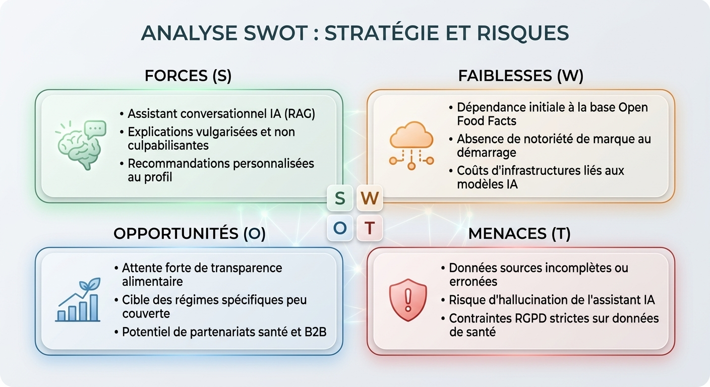

# Document de Cadrage, Benchmark & Stratégie Produit - NutriScope

---

## 1. Contexte du projet

### Contexte général et étude précédente

Aujourd'hui, les consommateurs cherchent à adopter une alimentation plus saine, mais se heurtent à la complexité des étiquettes nutritionnelles et au manque de temps lors de leurs achats.

L'analyse de notre parcours utilisateur actuel (situation AS-IS) met en avant plusieurs éléments clés :

- **Un besoin réel existe** : Les acheteurs veulent faire des choix éclairés en magasin sans perdre de temps. L'objectif est d'accéder à une information immédiate, accessible sans jargon technique et transmise sur un ton pédagogique, bienveillant et non culpabilisant.

- **Des frictions majeures persistent** : Les informations sont dispersées, le vocabulaire technique est difficile à interpréter, et les données ne sont pas personnalisées selon les contraintes individuelles (allergies, intolérances, objectifs nutritionnels ou régimes spécifiques).

- **Des améliorations sont possibles** : La centralisation de la donnée et la vulgarisation des informations permettent d'optimiser le parcours en magasin. Notre objectif est de réduire le temps de décision de l'utilisateur, en le faisant passer de plus d'une minute aujourd'hui à environ **30 secondes** en rayon.

- **Le projet est faisable** : L'exploitation de la base collaborative Open Food Facts, couplée à nos algorithmes internes et à un assistant conversationnel basé sur une architecture RAG, démontre la faisabilité technique, organisationnelle et juridique de la solution.

### Problématique

> **Pourquoi faire NutriScope alors que Yuka, Open Food Facts, ScanUp, myLabel ou Foodvisor existent déjà ?**

---

## 2. Benchmark et analyse concurrentielle

### Identification des principaux concurrents

Pour évaluer le marché, nous avons identifié les principaux acteurs représentatifs utilisés par les consommateurs :

1. **Yuka** : L'acteur référent grand public axé sur la notation et la recommandation simplifiée.
2. **Open Food Facts** : La base de données open source et collaborative majeure qui alimente une partie importante de l'écosystème alimentaire.
3. **myLabel / ScanUp** : Des applications spécialisées dans la personnalisation selon certains critères (éthique, environnement, transformation des aliments, allergènes).
4. **Foodvisor** : Application de coaching nutritionnel proposant un suivi alimentaire personnalisé, des recommandations nutritionnelles et des outils d'accompagnement liés aux objectifs de santé et de bien-être.

---

### Fonctionnalités observées chez les concurrents

| Concurrents | Type d'outil | Scan code-barres | Explication pédagogique | Recommandation | Personnalisation | Assistant conversationnel | Analyse nutritionnelle |
| :--- | :--- | :---: | :---: | :---: | :---: | :---: | :---: |
| **Yuka** | Application grand public | Oui | Partielle (Note /100) | Oui | Non (Note générique) | Non | Oui (Barème propre) |
| **Open Food Facts** | Base de données ouverte | Oui | Non (Données brutes) | Non | Non | Non | Oui (Nutri-Score, NOVA) |
| **myLabel / ScanUp** | Application spécialisée | Oui | Partielle (Filtres visuels) | Limitée | Oui (Éthique / Allergènes) | Non | Oui (Composition / Additifs) |
| **Foodvisor** | Assistant nutritionnel et coaching alimentaire | Oui | Oui (Conseils nutritionnels) | Oui | Oui (Objectifs et profils) | Non | Oui |

---

### Synthèse et analyse des données

L'analyse comparative de ces fonctionnalités montre un espace vacant sur le marché :

- **Généralisation vs Personnalisation** : Les applications leaders (comme Yuka) attribuent une note unique à un produit, sans tenir compte des besoins spécifiques de l'utilisateur (diabète, objectifs sportifs, allergies).

- **Absence d'accompagnement interactif** : Aucune solution actuelle ne propose de dialogue conversationnel permettant de poser des questions précises sur la composition d'un produit en magasin.

- **Besoin de vulgarisation non culpabilisante** : La donnée brute fournie par Open Food Facts reste difficile à interpréter directement pour le grand public sans un travail de traduction en langage clair.

- **Limite du coaching nutritionnel actuel** : Certaines solutions comme Foodvisor proposent un accompagnement personnalisé et des objectifs nutritionnels, mais restent principalement orientées suivi alimentaire. L'aide à la décision immédiate en magasin et la possibilité d'interroger directement un produit restent peu développées.

---

### Matrice comparative des fonctionnalités

| Fonctionnalités / Critères | Yuka | Open Food Facts | myLabel / ScanUp | Foodvisor | NutriScope *(Notre solution)* |
| :--- | :---: | :---: | :---: | :---: | :---: |
| **Scan de code-barres** | 🟢 | 🟢 | 🟢 | 🟢 | 🟢 |
| **Analyse nutritionnelle globale** | 🟢 | 🟢 | 🟢 | 🟢 | 🟢 |
| **Recommandation d'alternatives** | 🟢 | 🔴 | 🔴 | 🟢 | 🟢 |
| **Explication vulgarisée de la note** | 🔴 | 🔴 | 🔴 | 🟢 | 🟢 |
| **Personnalisation selon profil (santé/objectifs)** | 🔴 | 🔴 | 🟢 | 🟢 | 🟢 |
| **Assistant conversationnel IA (RAG)** | 🔴 | 🔴 | 🔴 | 🔴 | 🟢 |
| **Approche pédagogique et non culpabilisante** | 🔴 | 🔴 | 🟢 | 🟢 | 🟢 |

---

### Points différenciants de NutriScope

NutriScope se démarque directement des acteurs existants par plusieurs leviers :

- **Un accompagnement conversationnel** : Permet à l'utilisateur de poser ses propres questions (« Pourquoi ce produit est-il trop sucré pour mon profil ? »).

- **Une explicabilité sur mesure** : Traduction des données nutritionnelles brutes en conseils clairs, contextualisés et non culpabilisants.

- **Une personnalisation poussée** : Prise en compte réelle des contraintes de l'utilisateur (famille pressée, personne diabétique, sportif, allergies, intolérances) plutôt qu'une note globale arbitraire.

- **Une aide directe à la décision en magasin** : Là où certaines applications se concentrent sur le suivi alimentaire ou l'affichage d'une note, NutriScope intervient au moment où l'utilisateur doit choisir entre plusieurs produits.

---

## 3. Analyse SWOT

### Schéma visuel de la matrice SWOT

---

### Détail des éléments du SWOT

#### Forces (Strengths)

- **Assistant conversationnel (IA/RAG)** permettant d'interroger directement l'application.
- **Discours pédagogique et bienveillant**, évitant l'effet culpabilisant des notes brutes.
- **Recommandations adaptées au profil** (allergies, objectifs nutritionnels, préférences alimentaires).
- **Centralisation des informations** dans une interface unique.
- **Aide à la décision rapide** en situation d'achat.

#### Faiblesses (Weaknesses)

- **Dépendance à une source de données tierce** (Open Food Facts).
- **Notoriété à construire** face à des concurrents déjà bien installés.
- **Coûts techniques et de maintenance** liés à l'hébergement des services d'analyse.
- **Besoin d'assurer une qualité élevée des données** pour garantir la pertinence des recommandations.

#### Opportunités (Opportunities)

- **Besoin croissant de transparence alimentaire** chez les consommateurs.
- **Besoin non satisfait** pour les profils à contraintes spécifiques (diabétiques, sportifs, allergies, régimes particuliers).
- **Perspectives B2B** auprès des professionnels de santé, diététiciens, nutritionnistes, mutuelles et acteurs de la prévention.
- **Évolution vers des services de personnalisation avancés** et d'accompagnement nutritionnel.

#### Menaces (Threats)

- **Qualité variable des données sources** (valeurs manquantes ou aberrantes).
- **Exigences réglementaires strictes** concernant le RGPD et les réglementations relatives à l'intelligence artificielle.
- **Risque de perte de confiance** en cas de réponse inexacte ou de recommandation peu pertinente.
- **Présence d'acteurs établis** tels que Yuka et Foodvisor disposant déjà d'une communauté importante.

---

## 4. Proposition de valeur

Là où les solutions actuelles se limitent souvent à attribuer une note globale ou à présenter des données nutritionnelles brutes, **NutriScope apporte une valeur ajoutée centrée sur la compréhension et la prise de décision**.

### Nos objectifs

#### 1. Gagner du temps en magasin

Réduire le temps d'analyse d'un produit d'environ une minute à moins de trente secondes grâce à une synthèse directement exploitable.

#### 2. Vulgariser sans culpabiliser

Expliquer clairement les points d'attention d'un produit dans un langage compréhensible par tous, sans jugement ni discours anxiogène.

#### 3. Adapter l'information à l'individu

Fournir des recommandations tenant compte des contraintes et objectifs propres à chaque utilisateur plutôt qu'une évaluation générique.

---

### Proposition de valeur (version courte)

> NutriScope aide les consommateurs à comprendre rapidement un produit alimentaire et à identifier les alternatives les plus adaptées à leurs besoins, sans avoir à analyser eux-mêmes des informations nutritionnelles complexes.

---

### Proposition de valeur (version détaillée)

NutriScope accompagne les consommateurs lors de leurs achats alimentaires en centralisant les informations issues de différentes sources puis en les transformant en explications simples, compréhensibles et contextualisées.

Contrairement aux solutions reposant principalement sur une note ou sur l'affichage de données brutes, NutriScope cherche à expliquer le produit consulté, mettre en évidence les éléments réellement importants pour l'utilisateur et proposer des alternatives adaptées à son profil et à ses objectifs.

L'objectif est de permettre une prise de décision plus rapide, plus éclairée et plus personnalisée, directement au moment de l'achat.

---

## 5. Synthèse

| Question | Réponse |
|-----------|----------|
| Quel problème résout NutriScope ? | La difficulté à comprendre et comparer rapidement les produits alimentaires |
| Pour qui ? | Les consommateurs souhaitant faire des choix alimentaires plus éclairés |
| Quelle différence principale ? | Une approche pédagogique, personnalisée et interactive |
| Quel bénéfice utilisateur ? | Gagner du temps et mieux comprendre ce qu'il achète |
| Quel concurrent est le plus proche ? | Foodvisor sur la personnalisation, Yuka sur la notoriété |
| Quel avantage concurrentiel ? | L'explication contextualisée et l'assistance conversationnelle au moment de l'achat |
| Quel objectif final ? | Faciliter la prise de décision alimentaire en magasin |